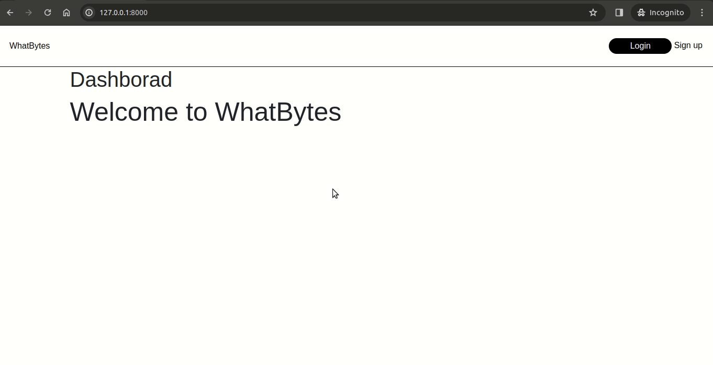

# WhatBytes Assignment

## Demo


## Run Locally

Create virtual environment

```bash
  pipenv shell
```

Clone the project

```bash
  git clone https://github.com/suraj-py/WhatBytes-Assignment.git
```
Install dependencies

```bash
  pip install -r requirements.txt
```

Start the server

```bash
  python manage.py runserver
```
